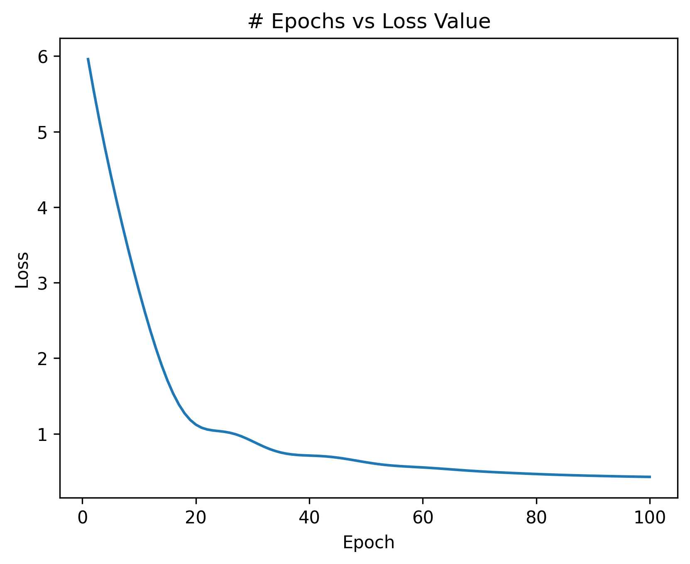

# Assignment 2: California Housing Regression

This project explores the California Housing dataset and compares a baseline Linear Regression model with a shallow Neural Network implemented using PyTorch.

---

# Running the Code

Create and activate the Conda environment using the required library versions:

```bash
conda create -n env_csci4425 python=3.12.2
conda activate env_csci4425
conda install numpy=2.4.1
conda install matplotlib=3.10.8
conda install pandas=2.3.3
conda install scikit-learn=1.8.0
conda install -c conda-forge scikit-datasets=0.2.5
conda install pytorch=2.5.1 torchvision=0.20.1 torchaudio=2.5.1
```

Run the program using:

```bash
python hw2.py
```

---

# Part 1: Dataset Exploration

The California Housing dataset was loaded using `fetch_california_housing()` from Scikit-learn.

## Dataset Description

```text
.. _california_housing_dataset:

California Housing dataset
--------------------------

**Data Set Characteristics:**

:Number of Instances: 20640

:Number of Attributes: 8 numeric, predictive attributes and the target

:Attribute Information:
    - MedInc        median income in block group
    - HouseAge      median house age in block group
    - AveRooms      average number of rooms per household
    - AveBedrms     average number of bedrooms per household
    - Population    block group population
    - AveOccup      average number of household members
    - Latitude      block group latitude
    - Longitude     block group longitude

:Missing Attribute Values: None

This dataset was obtained from the StatLib repository.
https://www.dcc.fc.up.pt/~ltorgo/Regression/cal_housing.html

The target variable is the median house value for California districts,
expressed in hundreds of thousands of dollars ($100,000).

This dataset was derived from the 1990 U.S. census, using one row per census
block group. A block group is the smallest geographical unit for which the U.S.
Census Bureau publishes sample data (a block group typically has a population
of 600 to 3,000 people).

A household is a group of people residing within a home. Since the average
number of rooms and bedrooms in this dataset are provided per household, these
columns may take surprisingly large values for block groups with few households
and many empty houses, such as vacation resorts.

It can be downloaded/loaded using the
:func:`sklearn.datasets.fetch_california_housing` function.

.. rubric:: References

- Pace, R. Kelley and Ronald Barry, Sparse Spatial Autoregressions,
  Statistics and Probability Letters, 33:291-297, 1997.

```

## First Five Rows

```text
   MedInc  HouseAge  AveRooms  AveBedrms  Population  AveOccup  Latitude  Longitude  MedHouseVal
0  8.3252      41.0  6.984127   1.023810       322.0  2.555556     37.88    -122.23        4.526
1  8.3014      21.0  6.238137   0.971880      2401.0  2.109842     37.86    -122.22        3.585
2  7.2574      52.0  8.288136   1.073446       496.0  2.802260     37.85    -122.24        3.521
3  5.6431      52.0  5.817352   1.073059       558.0  2.547945     37.85    -122.25        3.413
4  3.8462      52.0  6.281853   1.081081       565.0  2.181467     37.85    -122.25        3.422
```

## Summary Statistics

```text
             MedInc      HouseAge      AveRooms     AveBedrms    Population      AveOccup      Latitude     Longitude   MedHouseVal
count  20640.000000  20640.000000  20640.000000  20640.000000  20640.000000  20640.000000  20640.000000  20640.000000  20640.000000
mean       3.870671     28.639486      5.429000      1.096675   1425.476744      3.070655     35.631861   -119.569704      2.068558
std        1.899822     12.585558      2.474173      0.473911   1132.462122     10.386050      2.135952      2.003532      1.153956
min        0.499900      1.000000      0.846154      0.333333      3.000000      0.692308     32.540000   -124.350000      0.149990
25%        2.563400     18.000000      4.440716      1.006079    787.000000      2.429741     33.930000   -121.800000      1.196000
50%        3.534800     29.000000      5.229129      1.048780   1166.000000      2.818116     34.260000   -118.490000      1.797000
75%        4.743250     37.000000      6.052381      1.099526   1725.000000      3.282261     37.710000   -118.010000      2.647250
max       15.000100     52.000000    141.909091     34.066667  35682.000000   1243.333333     41.950000   -114.310000      5.000010
```

---

# Part 2: Data Preprocessing

The dataset was separated into input features (`X`) and the target variable (`MedHouseVal`). The data was then split into an 80% training set and a 20% testing set using `random_state=0` for reproducibility.

The input features were standardized using Scikit-learn's `StandardScaler`. The scaler was fitted only on the training data (`X_train`) to prevent information from the test set from leaking into the training process. The fitted scaler was then used to transform both `X_train` and `X_test`.

- Training samples: **16512**
- Testing samples: **4128**
- Number of input features: **8**

---

# Part 3: Model Building and Training

## Model 1: Linear Regression

A Scikit-learn `LinearRegression` model was used as the baseline regression model. The model was trained using the scaled training features and the corresponding median house values.

## Model 2: PyTorch Neural Network

The second model was a shallow Multi-Layer Perceptron (MLP) implemented using PyTorch.

### Network Architecture

- Input layer: **8 features**
- Hidden layer: **32 neurons**
- Activation function: **ReLU**
- Output layer: **1 neuron**
- Loss function: **Mean Squared Error (MSE)**
- Optimizer: **Adam**
- Learning rate: **0.01**
- Training epochs: **100**

The architecture can be summarized as:

**8 Inputs → 32 Hidden Neurons → ReLU → 1 Output**

During each training epoch, the model performed a forward pass, calculated the MSE loss, performed backpropagation, and updated its weights using the Adam optimizer.

---

# Part 4: Model Evaluation

Both trained models were evaluated using the scaled testing dataset. The following regression metrics were calculated:

- Mean Squared Error (MSE)
- Root Mean Squared Error (RMSE)
- R-squared (R²)

Lower MSE and RMSE values indicate better predictive performance, while a higher R² value indicates that the model explains a larger fraction of the variation in the target variable.

---

# Part 5: Analysis and Interpretation

## Performance Comparison

| Model | MSE | RMSE | R² |
|---|---:|---:|---:|
| Linear Regression | 0.5290 | 0.7273 | 0.5943 |
| Neural Network | 0.4269 | 0.6534 | 0.6726 |

### Performance Analysis

The Neural Network performed better than the Linear Regression model on the test data. It achieved a lower MSE and RMSE, meaning that its predictions were closer to the true median house values. It also achieved a higher R² score, indicating that it explained more of the variation in the target variable.

Based on these evaluation metrics, **Neural Network** provided the better overall performance on the test dataset.

## Neural Network Training Loss

The following figure shows the Mean Squared Error training loss as a function of epoch.



### Training Analysis

The neural network training loss decreased from 5.9594 at the beginning of training to 0.4281 after 100 epochs. This represents a reduction of approximately 92.82% in the training loss. The decrease in loss indicates that the neural network learned patterns relating the input housing features to median house values. The largest improvements generally occur during the earlier epochs, while the rate of improvement becomes smaller later in training. This behavior indicates that the model is moving toward convergence.

---

# Conclusion

This project compared a baseline linear regression model with a shallow PyTorch neural network for predicting median California house values. Both models were trained using the same standardized training data and evaluated on the same held-out testing set. The comparison demonstrates how model performance can be quantitatively evaluated using MSE, RMSE, and R².
